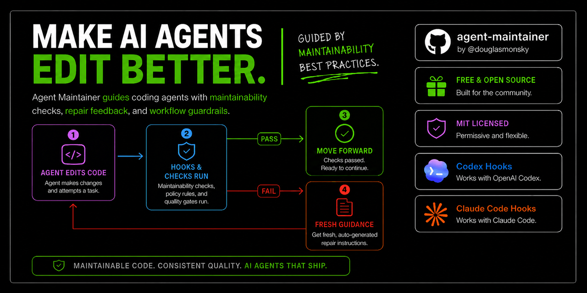
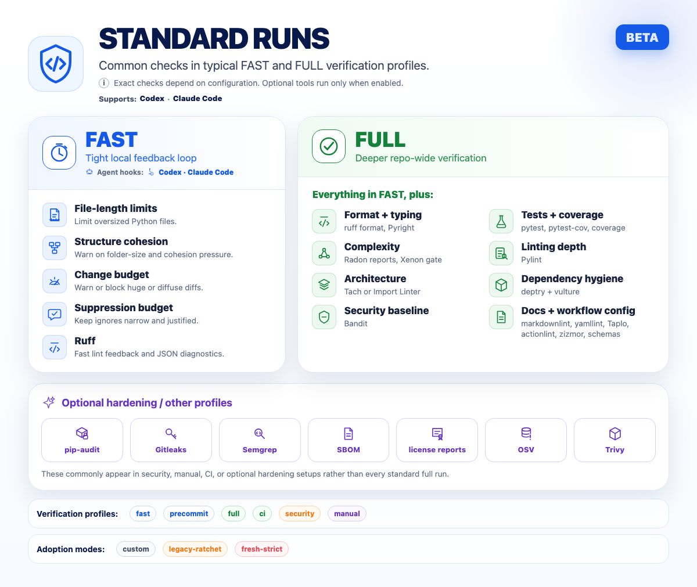

<!-- docsync:object docs.readme.overview -->
# Agent Maintainer

<p align="center">
  
</p>

[](https://github.com/douglasmonsky/agent-maintainer/actions/workflows/verify.yml)
[](https://pypi.org/project/agent-maintainer/)

[](LICENSE)

Maintainability checks and repair-loop diagnostics for AI-assisted Python
repositories.

> Agent Maintainer is in beta. The core workflow is usable today, but starter
> files and defaults may change as it is tested across more Python repository
> layouts.
>
> Latest published package: `agent-maintainer==0.1.0b10`, with immutable
> [release evidence](docs/releases/0.1.0b10.md). See the
> [upgrade guide](docs/upgrading-to-0.1.0b10.md) for package-index adoption and
> rollback guidance. This checkout targets the unpublished `0.1.0b11` release
> candidate; see its [candidate notes](docs/releases/0.1.0b11.md) and
> [evaluation guide](docs/upgrading-to-0.1.0b11.md).

Agent Maintainer helps coding agents make smaller, safer, more reviewable code
changes. It wraps your existing quality tools in low-noise profiles, adds
change-budget and ratchet discipline, writes bounded diagnostics under
`.verify-logs`, and gives agents exact repair commands instead of dumping huge
logs into chat.

Read more where it matters:

- [Quick start](docs/quick-start.md)
- [New-repository setup skill](docs/agent-maintainer-setup-skill.md)
- [First run walkthrough](docs/onboarding-first-run.md)
- [Diagnostics loop](docs/diagnostics-repair-loop.md)
- [Tool map](docs/tool-map.md)
- [Dependency risk register](docs/dependency-risk-register.md)
- [Security policy](SECURITY.md)
- [Support policy](SUPPORT.md)
- [Contributing](CONTRIBUTING.md)
- [Code of Conduct](CODE_OF_CONDUCT.md)

## What It Is

Agent Maintainer is a repository maintenance control layer for AI-assisted
software development. It checks whether changes are small enough to review,
test-backed, type-checked, covered, diagnosable, and aligned with repository
structure.

It is strongest when an AI agent actively edits the repo: the agent gets a
compact pass/fail summary, run id, failed checks, and exact next commands while
raw evidence stays in run-scoped artifacts.

<!-- docsync:object.end docs.readme.overview -->
<!-- docsync:object docs.readme.quick_start -->
## Quick Start

Install the core toolset:

```bash
python -m pip install "agent-maintainer[core]==0.1.0b10"
```

That pin installs the latest published beta. Follow the
[0.1.0b10 upgrade guide](docs/upgrading-to-0.1.0b10.md) for safe adoption and
rollback guidance.

Initialize a repo:

```bash
agent-maintainer init --track core --preset existing-app
```

For CI-only adoption without local hooks:

```bash
agent-maintainer init --ci-only
```

Merge `config/pyproject.agent-maintainer.toml` into your `pyproject.toml`, tune
paths, then run:

```bash
agent-maintainer doctor
agent-maintainer verify --profile precommit
```

A healthy verification run is intentionally quiet:

```text
PASS
```

If it fails, read the bounded repair note first:

```bash
cat .verify-logs/LAST_FAILURE.md
```

The note links to run-scoped logs and gives exact expansion/rerun commands.

<!-- docsync:object.end docs.readme.quick_start -->
## Best First Experience: Try A Fresh Strict Repo

The clearest way to feel the value is to let an agent build something new under
strict settings before entropy starts.

```bash
python -m pip install "agent-maintainer[core]"
agent-maintainer init --track agent --preset strict-new-repo
```

Then ask your coding agent to build a small package, add tests, and finish
with the shortest available completion command:

```bash
agent-maintainer verify --profile precommit
```

The strict preset turns on the pressure that matters for AI-generated code:
small functions, covered behavior, low complexity, no broad suppressions,
architecture ownership, and test-backed source changes.

Deeper reads:

- [Fresh strict](docs/fresh-strict.md)
- [Agent hooks](docs/agent-client-hooks.md)
- [Generated guidance](docs/agent-maintainer-guidance.md)

<!-- docsync:object docs.readme.adoption_tracks -->
## Adoption Tracks

`init` separates files written from policy strictness. Each track uses generated
initializer templates so downstream repos receive the config, workflow, hook,
and metadata files for their adoption level without vendoring Agent Maintainer
source.

Generated hook configuration keeps commits responsive by running the `fast`
staged profile plus mapped affected Python tests at `pre-commit`. It preserves
the complete local safety gate by running the `precommit` profile at
`pre-push`. That hook uses the exact outgoing SHAs supplied by pre-commit and
fails closed if the pushed local SHA is not the checked-out `HEAD` or the
checkout has staged, unstaged, or untracked changes; invoke it through
`git push` from a clean checkout rather than a ref-less manual hook-stage run.
`agent-maintainer install` installs both Git hook types, and doctor reports
either missing hook instead of treating a partial installation as healthy.

| Track | Best For | Writes |
|---|---|---|
| `core` | A minimum useful local CI maintenance loop. | Starter config, `config/dev-dependencies.txt`, pre-commit config, CI workflow. |
| `agent` | Repos where Codex, Claude Code, or other agents actively edit code. | Core plus `AGENTS.md`, generated guidance target, Codex hooks, Claude Code hooks. |
| `hardening` | Repos that want docs/config hygiene and security-adjacent surfaces too. | Agent plus Node-backed tooling metadata. |

Use `agent-maintainer init --ci-only` when a repo only needs the GitHub Actions
verification workflow and `config/dev-dependencies.txt`, without local hooks or
starter policy config.

The hardening track declares Node.js 22 or newer for its optional npm-backed
Markdown and TOML tooling instead of silently installing incompatible versions.

Agent and hardening scaffolds render Codex and Claude Code configuration plus
every referenced post-edit, PR-wait, stop, and audit wrapper from the same
managed-file inventory used by install, update, status, and uninstall. Generated
wrappers are checked for byte-for-byte currentness rather than existence alone.

Preview before writing:

```bash
agent-maintainer init --track agent --preset ai-agent-heavy --dry-run
```

The preview classifies each destination as add, unchanged, merge, conflict, or
skip without requiring force. Apply refuses the whole plan while an unresolved
conflict remains, preserves user-owned `AGENTS.md`, backs up explicit forced
replacements, and rolls back earlier writes if a later destination fails.

Presets tune policy:

| Preset | Use When |
|---|---|
| `small-library` | A compact package should start with tighter budgets. |
| `existing-app` | An existing repo needs useful defaults without immediate strict-mode friction. |
| `ai-agent-heavy` | Agents frequently change code and source-only changes should fail. |
| `legacy-ratchet` | Existing debt should improve through ranked repair targets. |
| `strict-new-repo` | A clean repo can start with strict wemake and tighter budgets. |
| `team-small-python-lib` | A team-owned package wants small-library defaults. |
| `team-legacy-service` | A team-owned service needs legacy ratchets first. |
| `team-agent-heavy` | A team relies heavily on coding agents. |
| `team-security-sensitive` | A clean security-sensitive repo wants strict starter defaults. |

Read more:

- [Quick start](docs/quick-start.md)
- [Legacy ratchet](docs/legacy-ratchet.md)
- [Fresh strict](docs/fresh-strict.md)
- [Team policy templates](docs/team-policy-templates.md)
<!-- docsync:object.end docs.readme.adoption_tracks -->
<!-- docsync:object docs.readme.run_profiles -->
## Run Profiles

<p align="center">
  
</p>

| Profile | Purpose |
|---|---|
| `fast` | Hook-friendly edit feedback. |
| `precommit` | Local completion gate before finishing a task. |
| `full` | Deeper review gate before larger changes. |
| `ci` | GitHub Actions-equivalent verification with branch comparison. |
| `security` | Security-oriented scans, including history-oriented secret scanning when configured. |
| `manual` | Slow or intentionally heavy checks such as Mutmut and Semgrep. |

When a repository has `.docsync/trace.yml`, the local profiles also run
DocSync freshness checks so code and documentation claims stay in sync.

Canonical commands:

```bash
agent-maintainer verify --profile precommit
agent-maintainer verify --profile full
agent-maintainer verify --profile ci --base-ref origin/main --compare-branch origin/main
agent-maintainer verify --profile security
agent-maintainer verify --profile manual
```

Read more:
[tool map](docs/tool-map.md),
[diagnostics repair loop](docs/diagnostics-repair-loop.md),
[verification cadence](docs/agent-maintainer-guidance.md).

<!-- docsync:object.end docs.readme.run_profiles -->
<!-- docsync:object docs.readme.verification_planning -->
## Diff-Aware Verification Planning

Use `agent-maintainer verify-plan` to map the current diff to affected package
or workspace units, matched repository-risk rules, named evidence, review
categories, configured checks, and canonical verifier commands. Planning is
advisory by default:

```bash
agent-maintainer verify-plan --base-ref origin/main
```

Repositories opt into declarative enforcement with
`.agent-maintainer/path-risk.toml`. Add `--enforce` when required missing
evidence should return exit status `1`:

```bash
agent-maintainer verify-plan --base-ref origin/main --enforce
```

A minimal versioned policy names a rule, its triggering paths, existing
profiles or checks, review categories, and optional changed-path evidence:

```toml
version = 1

[[rules]]
id = "architecture"
paths = ["tach.toml", "src/**/tach.domain.toml"]
mode = "required"
profiles = ["full"]
checks = ["tach"]
review_categories = ["architecture"]

[[rules.evidence]]
id = "decision"
kind = "changed-path"
paths = ["docs/architecture/decisions/*.md"]
minimum = 1
message = "Add or update an architecture decision."
```

Patterns are repository-relative and segment-aware: `*` matches within one
path segment, while `**` is valid only as a complete segment and crosses
directories. Unknown fields, duplicate identifiers, unsafe paths, and unknown
configured profile or check names fail closed.

Use `--staged` for an exact staged-diff plan and `--json` for the deterministic
`schema_version = 1` report. Invalid policy, configuration, or Git refs return
exit status `2`. The planner recommends evidence and existing profiles; it
never suppresses existing verifier gates or executes a reduced test set.

See the [tool map](docs/tool-map.md) and
[path-risk policy decision](docs/architecture/decisions/2026-07-18-diff-aware-verification-planning.md).
<!-- docsync:object.end docs.readme.verification_planning -->
<!-- docsync:object docs.readme.contract_ratchets -->
## Contract Compatibility Ratchets

Repositories can opt into semantic compatibility checks with strict authored
policy at `.agent-maintainer/contracts.toml` and a canonical generated baseline
at `.agent-maintainer/contracts-baseline.json`. Inspect every semantic change
and its revision, version, decision, and migration obligations with:

```bash
agent-maintainer contract diff --base-ref origin/main
```

Enforce baseline freshness and base-to-live compatibility with:

```bash
agent-maintainer contract check --base-ref origin/main
```

Pre-commit verification passes `--staged`, which reads policy, baseline,
package version, and contract sources from the Git index and evaluates migration
evidence from the staged diff. Unstaged worktree content cannot mask or invent a
staged contract change.

After reviewing an intentional change and satisfying its obligations, refresh
the canonical baseline explicitly:

```bash
agent-maintainer contract snapshot --write --base-ref origin/main
```

Use `--initialize` only for first adoption when no baseline exists; it records
that no historical compatibility claim was made. A base ref that predates
ratchet adoption cannot authorize replacement of an existing baseline. The
commands return `0` when
valid, `1` for unresolved compatibility or obligation findings, and `2` for
invalid or unsafe input. `--json` emits a deterministic `schema_version = 1`
report with exact fingerprints and repair facts.

Breaking beta changes remain possible. They require a contract revision,
sufficient package-version movement, changed migration evidence, and any exact
decision needed for review-required semantics. The ratchet protects declared
current contracts; it does not freeze every beta API or create a pre-1.0
cross-version guarantee.

See the [API support policy](docs/api-support-policy.md),
[tool map](docs/tool-map.md), and
[contract-ratchet decision](docs/architecture/decisions/2026-07-18-contract-compatibility-ratchets.md).
<!-- docsync:object.end docs.readme.contract_ratchets -->
<!-- docsync:object docs.readme.supported_checks -->
## Supported Checks And Scans

Agent Maintainer does not replace these tools. It coordinates them, gives them
stable profiles, captures artifacts, and turns failures into bounded repair
context.

| Area | Supported Checks |
|---|---|
| Change control | Change budget, staged diff checks, cohesive change plans, source-without-test-change policy. |
| Size and structure | File length budgets, folder cohesion hints, suppression budget, required layout checks. |
| Formatting and lint | Ruff format/check, Pylint, wemake-python-styleguide. |
| Types and tests | Pyright, pytest, pytest-cov, coverage, diff-cover. |
| Complexity | Radon reports, Xenon complexity gate. |
| Architecture | Tach, Import Linter, Archguard decision notes and impact tools. |
| Dependency hygiene | deptry, vulture. |
| Python security | Bandit, pip-audit. |
| Secrets | Gitleaks current-tree, staged/range, and history modes. |
| Ecosystems | Python core/reference provider; experimental configured-command TypeScript/JavaScript provider; experimental Java/Gradle provider with checked-wrapper tasks, structured reports, and ratchets. |
| SAST | Semgrep in manual profile when enabled. |
| Multi-ecosystem CVEs | OSV Scanner when enabled. |
| Containers/IaC | Trivy when relevant to the repo. |
| SBOM and licenses | CycloneDX Python SBOM, pip-licenses. |
| GitHub Actions | actionlint, zizmor. |
| Docs/config hygiene | DocSync freshness checks, markdownlint-cli2, yamllint, Taplo, check-jsonschema. |
| Mutation testing | Mutmut target ratchet, result ratchets, advisory deep sweep executor. |
| Agent repair loop | `.verify-logs`, context commands, repair plans, PR summaries, static HTML reports. |

The verifier invokes DocSync with `--write-reports` so JSON/SARIF repair
artifacts are an explicit integration output. A standalone `docsync check`
remains read-only.

Read more:
[optional gates](docs/optional-gates.md),
[supported scans and agent use](docs/supported-scans-and-agent-use.md),
[ecosystem provider status](docs/provider-status.md),
[experimental Java/Gradle provider](docs/java-gradle-provider.md),
[multi-ecosystem reviewability policy](docs/multi-ecosystem-reviewability-policy.md),

[mutation testing](docs/mutation-testing.md),
[architecture policy](docs/architecture-policy.md),
[test intelligence](docs/test-intelligence.md).

<!-- docsync:object.end docs.readme.supported_checks -->
## Ratcheting: Improve Existing Repos Without Freezing Them

Legacy repos usually cannot become strict overnight. Agent Maintainer separates
new regressions from old debt:

- changed-code coverage can block new untested work;
- suppression budget blocks new broad `noqa`, `type: ignore`, and coverage
  escapes;
- file-length and structure checks can warn before they block;
- ratchet commands rank the next repair targets;
- mutation target/result ratchets keep high-value mutation testing focused.

Useful commands:

```bash
python3 -m agent_maintainer ratchet status
python3 -m agent_maintainer ratchet next
python3 -m agent_maintainer attention update
python3 -m agent_maintainer attention top
python3 -m agent_maintainer events summary
python3 -m agent_maintainer events waste
python3 -m agent_maintainer events export --format jsonl
python3 -m agent_maintainer events export --format otel-json
python3 -m agent_maintainer scoring examples list
python3 -m agent_maintainer scoring examples export --format jsonl
python3 -m agent_maintainer verify --profile full --async
python3 -m agent_maintainer wait github-run <run-id>
python3 -m agent_maintainer wait verifier <run-id>
python3 -m agent_maintainer test-intel mutation-results
python3 -m agent_maintainer test-intel mutation-sweep
```

Read more:
[ratcheting](docs/ratcheting.md),
[mutation testing](docs/mutation-testing.md),
[cohesive change plans](docs/cohesive-change-plans.md).

<!-- docsync:object docs.readme.agent_loop -->
## How Agents Should Use It

For agent-heavy repos, install the `agent` track and commit the generated
guidance:

```bash
agent-maintainer init --track agent --preset ai-agent-heavy
python3 -m agent_maintainer guidance
```

Then agents should follow this loop:

1. Read `AGENTS.md` and `AGENTS.agent-maintainer.md`.
2. Make a small, coherent change.
3. Run focused tests while editing.
4. Let trusted Stop/SubagentStop hooks cover `precommit` for the final state.
   Run `just verify-precommit` only when hooks are unavailable, bypassed, or
   a failure needs reproduction.
5. If verification fails, inspect `.verify-logs/LAST_FAILURE.md` and use the
   suggested `context` command instead of dumping raw logs.
6. For larger work, run one broad local profile before PR, usually `full`.
   Use `ci` instead when diff/base-ref, workflow, or profile behavior changed;
   run both only when that overlap is under test. Run `security` or `manual`
   when touching those gates, before release, or when explicitly requested.

7. When GitHub Actions or verifier jobs are still running, use
   `just wait-github <run-id>`, `just wait-pr <pr-number>`, or
   `just wait-verifier <run-id>` so the tool owns polling and returns one final
   repair capsule.

Helpful repair commands:

```bash
python3 -m agent_maintainer context failures --limit 20
python3 -m agent_maintainer context log pyright --tail 120
python3 -m agent_maintainer repair-plan
python3 -m agent_maintainer report html
```

Read more:
[agent hooks](docs/agent-client-hooks.md),
[context safety](docs/context-safety.md),
[diagnostics repair loop](docs/diagnostics-repair-loop.md).

<!-- docsync:object.end docs.readme.agent_loop -->
## Trust Model

Agent Maintainer is designed to be safe to try:

- MIT licensed and open source.
- Package-first; downstream repos should not vendor `src/agent_maintainer`.
- Local-first verification; normal checks run against your repo and local tool
  outputs.
- Hooks no-op outside repos with `[tool.agent_maintainer]`.
- Output is bounded; raw logs live in `.verify-logs/runs/<run-id>/`.
- Secret scan artifacts are treated as sensitive/redacted diagnostics.
- CI uses least-privilege permissions and package-index publishing uses trusted
  publishing.
- This repo dogfoods strict settings, Python 3.11-3.14 compatibility, release
  checks, mutation ratchets, OSV, SBOM, licenses, docs/config hygiene, Codex
  hooks, and Claude Code hooks.

Read more:
[Release checklist](docs/release-checklist.md),
[troubleshooting](docs/troubleshooting.md),
[release index](docs/releases/README.md),
[0.1.0b7 release evidence](docs/releases/0.1.0b7.md),
[0.1.0b8 release evidence](docs/releases/0.1.0b8.md),
[0.1.0b9 release evidence](docs/releases/0.1.0b9.md),
[0.1.0b10 release evidence](docs/releases/0.1.0b10.md),
[0.1.0b10 upgrade guide](docs/upgrading-to-0.1.0b10.md),
[0.1.0b11 candidate notes](docs/releases/0.1.0b11.md),
[0.1.0b11 evaluation guide](docs/upgrading-to-0.1.0b11.md).

## Configuration

Configuration can live in `pyproject.toml` or in a neutral Agent Maintainer
config file. Python repos should usually keep using `[tool.agent_maintainer]`
in `pyproject.toml`; mixed or future non-Python repos can use
`.agent-maintainer/config.toml` or `agent-maintainer.toml`.

```toml
[tool.agent_maintainer]
mode = "custom"
architecture_tool = "import-linter"
source_roots = ["src"]
test_roots = ["tests"]
package_paths = ["src"]
coverage_source = ["src"]
require_tests = true
coverage_fail_under = 80
diff_cover_fail_under = 90

[tool.agent_maintainer.diagnostics]
enabled = true
log_dir = ".verify-logs"
run_history_limit = 10
```

Precedence is built-in defaults, mode defaults, file config, environment
variables, then CLI flags. When multiple file configs exist,
`pyproject.toml` `[tool.agent_maintainer]` wins; otherwise
`.agent-maintainer/config.toml` wins over `agent-maintainer.toml`.
Environment overrides use the `AGENT_MAINTAINER_*` prefix.

Known commands validate the complete resolved policy before running behavior.
Invalid configuration exits with status 2 and reports the source plus dotted
key; help remains available for repair and discovery.

```bash
AGENT_MAINTAINER_SOURCE_ROOTS=src,tests python3 -m agent_maintainer doctor
```

Read more:
[quick start](docs/quick-start.md),
[configuration reference](docs/configuration-reference.md),
[structure cohesion](docs/structure-cohesion.md),
[tool map](docs/tool-map.md).

## Setup Recommendations

Ask Agent Maintainer to inspect the repo before choosing a track and preset:

```bash
python3 -m agent_maintainer assess setup
python3 -m agent_maintainer assess setup --json
```

The advisor recommends `core`, `agent`, or `hardening`; a starting preset;
optional gates that match repository evidence; and follow-up prompts a coding
agent should answer before tightening config.

Read more:
[setup advisor](docs/setup-advisor.md).

## Reviewability Assessment

Inspect changed files by provider ecosystem and role without changing blocking
policy:

```bash
python3 -m agent_maintainer assess reviewability
python3 -m agent_maintainer assess reviewability --json
```

This is advisory. In the current beta, blocking reviewability gates remain
Python-backed while TypeScript/JavaScript policy adapters mature.

Read more:

[multi-ecosystem reviewability policy](docs/multi-ecosystem-reviewability-policy.md).

## File Baseline Assessment

Inspect simple file facts across configured file groups without changing
blocking verifier policy:

```bash
python3 -m agent_maintainer assess file-baselines
python3 -m agent_maintainer assess file-baselines --json
```

This is advisory. It works from explicit include/exclude globs and reports
matched files, changed files, changed lines, line-count findings, and compact
next commands. It is the broad filetype/path layer for docs, config, tests,
TSX, YAML, TOML, or other file groups; language-specific architecture still
belongs to provider adapters such as Tach for Python.

Read more:

[provider-neutral file baselines](docs/roadmap/provider-neutral-file-baselines.md).

<!-- docsync:object docs.readme.technical_debt -->
## Technical Debt Score

Generate an advisory maintenance-risk scorecard:

```bash
python3 -m agent_maintainer assess debt
python3 -m agent_maintainer assess debt --json
python3 -m agent_maintainer report html
```

The score is lower-is-better and decomposes into reviewability, tests/coverage,
type/style, architecture, dependencies/security, docs/config hygiene,
diagnostics, and ratchet/mutation maturity. It writes JSON and Markdown
artifacts under `.verify-logs` and appears in the verification summary and HTML
report when present.

Read more:
[Technical Debt Score](docs/technical-debt-score.md).

<!-- docsync:object.end docs.readme.technical_debt -->
## Install From Source

For local development on Agent Maintainer itself:

```bash
git clone https://github.com/douglasmonsky/agent-maintainer.git
cd agent-maintainer
python -m pip install -e ".[core]"
agent-maintainer --help
```

Normal downstream repositories should use the package-first init flow rather
than copying `src/agent_maintainer` into application source trees.

## Local Development

For this repo, use the checked-in command wrappers so agents do not have to
reconstruct long environment-prefixed commands:

```bash
just bootstrap
python3 -m agent_maintainer install --dry-run
python3 -m agent_maintainer install
just doctor
just verify-precommit
just verify
```

`bootstrap` installs development dependencies only. Hook and pre-commit setup
is an explicit, previewable `install` action.

Refresh the pinned dev lock after changing `config/dev-dependencies.in`:

```bash
just bootstrap
just refresh-dev-lock
```

The repository pins direct development tools in `config/dev-dependencies.in`
and uses `pip-compile` under Python 3.13 to resolve their compatible
graph into `config/dev-lock.txt`. Dependabot groups compatible direct updates;
it does not propose isolated transitive-lock edits.

Read more:
[Release checklist](docs/release-checklist.md),
[troubleshooting](docs/troubleshooting.md),
[roadmap](docs/ROADMAP.md).

## Further Reading

- [Changelog](CHANGELOG.md)
- [MIT License](LICENSE)
- [Security](SECURITY.md)
- [Support](SUPPORT.md)
- [Contributing](CONTRIBUTING.md)
- [Pre-1.0 API support](docs/api-support-policy.md)
- [Subsystem stability](docs/architecture/subsystem-stability.md)
- [Context compression](docs/context-compression.md)
- [Cohesive change plans](docs/cohesive-change-plans.md)
- [Roadmap blueprint index](docs/roadmap/full-roadmap-blueprint.md)

Example starter projects:

- [Fresh-strict example](examples/fresh-strict)
- [Legacy-ratchet example](examples/legacy-ratchet)
- [Context-safe ratchet proof example](examples/context-safe-ratchet)
- [Cohesive change-plan proof example](examples/cohesive-change-plan)
- [Test-intelligence proof example](examples/test-intelligence)

Measured fixture case studies:

- [Split large legacy file](docs/case-studies/split-large-legacy-file.md)
- [Context-safe ratchet repair](docs/case-studies/context-safe-ratchet-repair.md)
